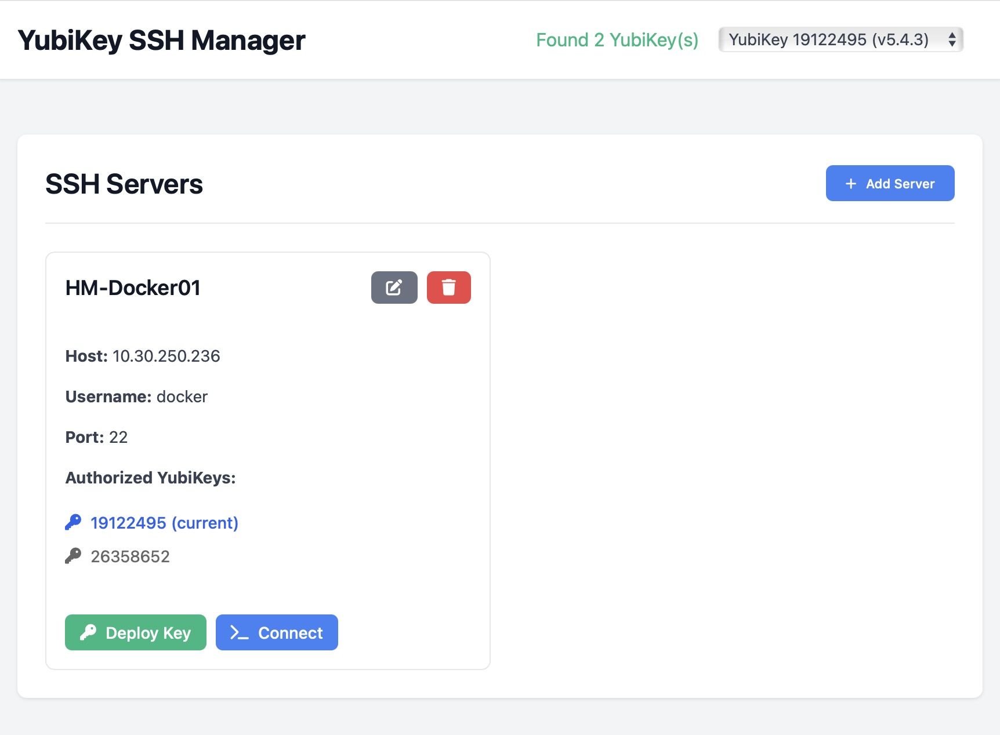

# YubiKey SSH Manager

A macOS application that simplifies SSH server access using your YubiKey's self-signed certificate. The application runs in your menu bar and provides a web interface for managing SSH servers and deploying your YubiKey's public key.

## Screenshots

### Web Interface

*The web interface allows you to manage servers, check YubiKey status, and initiate SSH connections.*

### Add New Server

*Enter server details and deploy YubiKey public key to the server.*

### Menu Bar

*Quick access to your servers directly from the macOS menu bar.*

## Features

- macOS menu bar application for quick access
- Web interface for managing SSH servers
- Automatic YubiKey public key deployment to servers
- Secure SSH connections using YubiKey authentication
- Server configuration management

## Prerequisites

- macOS
- Python 3.13+
- YubiKey with PIV capability
- SSH access to your servers

## Installation

1. Clone the repository:
```bash
git clone https://github.com/robertherbaugh/yubikey-ssh-manager.git
cd yubikey-ssh-manager
```

2. Create a virtual environment and activate it:
```bash
python -m venv .venv
source .venv/bin/activate
```

3. Install the required packages:
```bash
pip install -r requirements.txt
```

4. Install YubiKey PIV Client:
```bash
brew install yubico-piv-tool
```

## Usage

1. Start the application:
```bash
python app.py
```

2. The application will appear in your menu bar with a 🔐 icon.

3. Click the icon and select "Open Web Interface" to access the web interface.

4. In the web interface, you can:
   - Check YubiKey status
   - Add new servers
   - View and manage existing servers
   - Connect to servers using YubiKey authentication

## Adding a New Server

1. Click "Open Web Interface" from the menu bar icon
2. Select your YubiKey from the YubiKey menu
3. Fill in the server details:
   - Server Name (for identification)
   - Hostname (IP address or domain)
   - Username
   - Port (default: 22)
4. Click "Add Server"

The application will automatically deploy your YubiKey's public key to the server when you first connect.

## Security

- All server credentials are stored locally in `~/.yubikey-ssh-manager/servers.json`
- The application uses your YubiKey's self-signed certificate for SSH authentication
- **No passwords are stored; password is only required for key deployment.**

## Troubleshooting

1. YubiKey not detected:
   - Ensure your YubiKey is properly inserted
   - Check if the YubiKey manager can detect your device

2. Connection issues:
   - Verify server credentials are correct
   - Ensure the server allows public key authentication
   - Check server SSH configuration

## Contributing

Contributions are welcome! Please feel free to submit a Pull Request.

## License

This project is licensed under the MIT License - see the LICENSE file for details.
